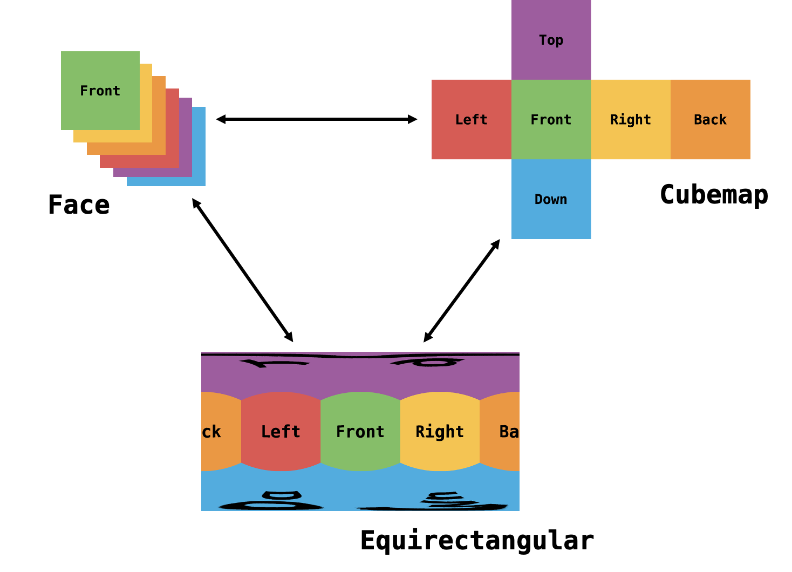

# 360-converter

## Overview


## Prerequisites
This project has been tested on:
- Ubuntu 18.04
- G++ 7.5.0
- Clang 6.0.0

The only thing you need is a C/C++ compiler, no other package do you need to install.

## Run example
```
git clone https://github.com/chinhsuanwu/360-converter.git
cd 360-converter
make
make run
```

## Usage
Just directly include the [`converter.hpp`](https://github.com/chinhsuanwu/360-converter/blob/master/src/converter.hpp) in folder `src`
```c++
#include "src/converter.hpp"
```
For example:
- To convert from `Cube` to `Equi`
    ```c++
    Converter::Equi equi = cube.toEqui();
    ```
- To get image
    ```c++
    Converter::Image img = equi.getEqui();
    ```
- To write image
    ```c++
    stbi_write_png("out/equi.png", img.w, img.h, CHANNEL_NUM, img.img, img.w*CHANNEL_NUM);
    ```
Find out more at [example.cpp](https://github.com/chinhsuanwu/360-converter/blob/master/example/example.cpp)

## Acknowledgement
This project is using [stb](https://github.com/nothings/stb) library for image I/O, great thanks to their excellent work.